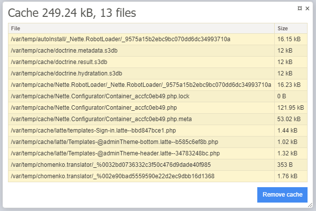

# Cache Cleaner

Extension from Nette framework

## Install

````sh
composer require chomenko/cache-cleaner
````

## Configuration

register extension
```neon
extensions:
    CacheCleaner: Chomenko\CacheCleaner\DI\CacheCleanerExtension
```

**Optional configuration** <br>
``dirs`` directory list for clean <br>
``ignoreFiles`` file list for ignore <br>

```neon
CacheCleaner:
	dirs:
		- %tempDir%
	ignoreFiles:
		- .gitignore
		- .gitkeep
```

## Use

Console
```bash
php www/index.php cache:clean
```

or tracy panel <br>
